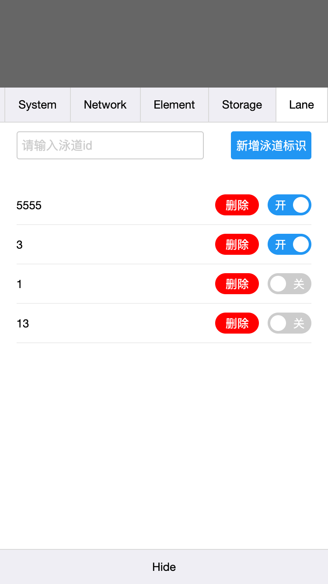

# vConsole-lane-plugin
**泳道插件**

主要用于解决测试环境中反复切换泳道的问题，只要引入vconsole，就可以利用该插件管理泳道信息，方便快捷


# 使用
**方法一： npm包**

1. 安装
```
npm i --save-dev vConsole-lane-plugin
```
2. 初始化
```
import VConsole from 'vconsole';
import VConsoleLanePlugin from 'vConsole-lane-plugin';
const vConsole = new VConsole();
const plugin = new VConsoleLanePlugin(vConsole);
```


**方法二：外链**
```
<script src="https://cdn.bootcss.com/vConsole/3.2.2/vconsole.min.js"></script>
<script src="/dist/vconsole-lane-plugin.min.js"></script>

const vConsole = new VConsole();
const plugin = new VConsoleLanePlugin(vConsole);
```

# 效果

